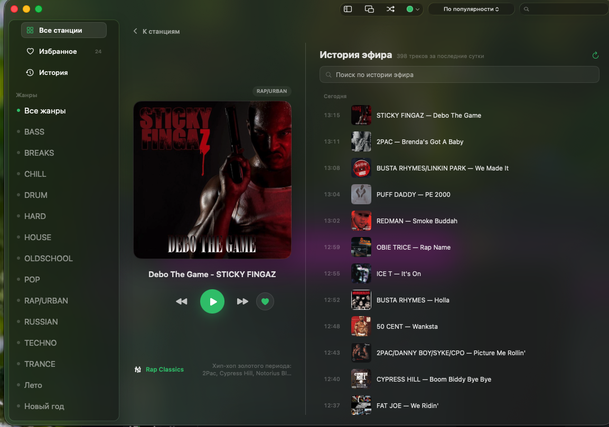
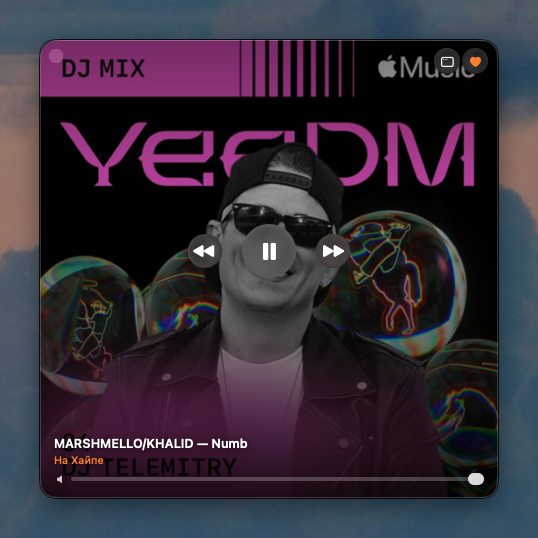
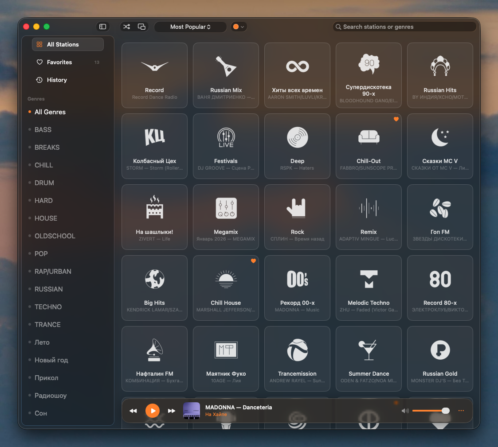
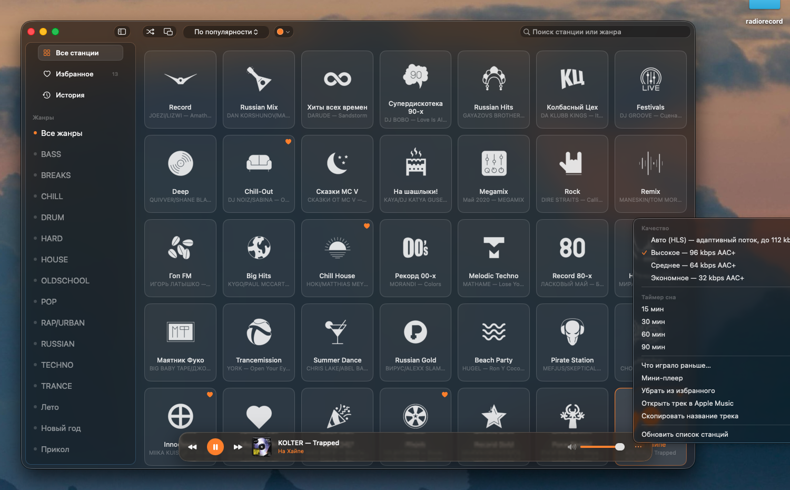
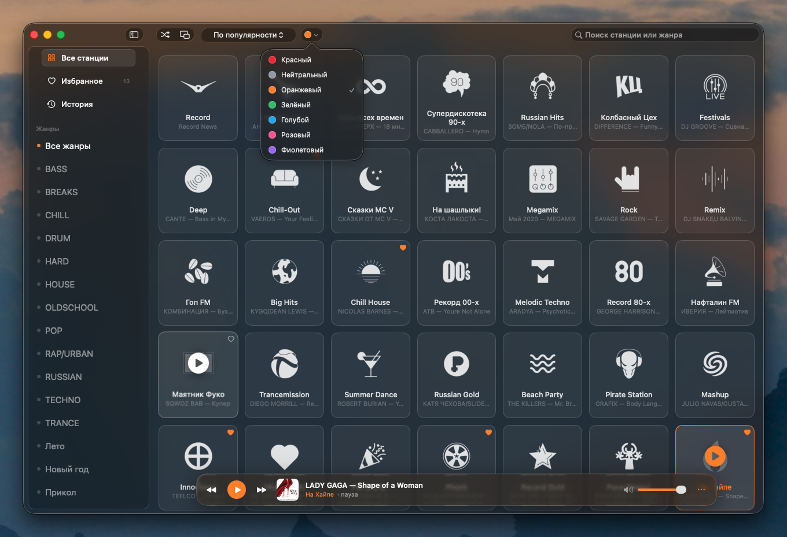

# Record for macOS

Нативный неофициальный плеер Radio Record для macOS.

An unofficial native Radio Record player for macOS.

[Скачать Record 1.7](https://github.com/ohjohnnyoh/record-player-macos/releases/latest) · [English](#english) · [Все скриншоты](docs/screenshots)


## Русский

Record позволяет слушать все станции Radio Record без браузера. Это обычное приложение для macOS: с отдельным мини-плеером, управлением из строки меню, медиаклавишами, историей треков и локальной статистикой прослушивания.

Интерфейс работает на русском и английском. Язык выбирается автоматически по настройкам macOS.

### Скачать и установить

1. Скачайте [`Record-1.7.dmg`](https://github.com/ohjohnnyoh/record-player-macos/releases/download/v1.7/Record-1.7.dmg).
2. Откройте образ и перетащите Record в папку «Программы».
3. При первом запуске нажмите на приложение правой кнопкой мыши и выберите **Открыть**.
4. Подтвердите запуск в появившемся окне.

У приложения локальная ad-hoc подпись, но нет сертификата Apple Developer ID и нотарификации. Поэтому Gatekeeper может показать предупреждение. Правый клик нужен только при первом запуске.

Если macOS всё равно блокирует приложение, снимите карантин вручную:

```bash
xattr -dr com.apple.quarantine /Applications/Record.app
```

Требуется macOS 14 или новее. На macOS 26 используется нативный Liquid Glass. На macOS 14 и 15 приложение переключается на системные материалы AppKit.

### Возможности

- **Все 117 станций:** каталог загружается из публичного API Radio Record и сохраняется в локальный кэш.
- **Избранное и поиск:** станции можно искать по названию и жанру, сортировать по популярности или алфавиту.
- **Стеклянный плеер:** плавающая панель остаётся поверх каталога, а карточки прокручиваются под ней.
- **Мини-плеер:** отдельное квадратное окно с обложкой, громкостью и управлением воспроизведением.
- **Строка меню:** текущий трек, избранные станции и основные кнопки доступны без открытия главного окна.
- **Полный режим станции:** нажмите обложку в нижнем плеере, чтобы открыть крупную обложку текущего трека, управление станцией, поиск и историю эфира за последние сутки.
- **История и статистика:** данные хранятся только на этом Mac.
- **Apple Music:** трек можно открыть в Apple Music или скопировать его название.
- **Системное управление:** работают медиаклавиши, панель «Сейчас исполняется» и пространственное аудио AirPods.
- **Четыре режима качества:** Auto HLS, 96, 64 и 32 kbps AAC+.
- **Таймер сна:** 15, 30, 60 или 90 минут.
- **Автообновление:** Record раз в сутки проверяет подписанный канал обновлений. Новую версию можно установить из приложения, отложить до завтра или пропустить. Ручная проверка доступна в меню приложения.
- **Accessibility:** VoiceOver, управление с клавиатуры, Reduce Motion, Reduce Transparency и повышенный контраст.

### Интерфейс

| Полный режим станции | Режим с боковой панелью |
|---|---|
|  |  |

| Избранное | История треков |
|---|---|
|  |  |

| Статистика | Поиск |
|---|---|
|  |  |

| Мини-плеер | Плеер в строке меню |
|---|---|
|  |  |

[Посмотреть все 12 скриншотов](docs/screenshots)

### Горячие клавиши

| Клавиши | Действие |
|---|---|
| `Пробел` или `⌘P` | Играть или поставить на паузу |
| `⌥⌘M` | Открыть мини-плеер |
| `⌘→` и `⌘←` | Следующая или предыдущая станция |
| `⇧⌘R` | Случайная станция |
| `⌘↑` и `⌘↓` | Изменить громкость |
| `⌘M` | Выключить или включить звук |

### Сборка из исходников

```bash
./build.sh
```

Скрипт собирает релизную версию, создаёт `Record.app`, генерирует иконку, добавляет локализации и подписывает приложение ad-hoc подписью. По умолчанию готовое приложение устанавливается в `/Applications`.

Собрать приложение без установки:

```bash
./build.sh --no-install
```

Собрать установочный DMG:

```bash
./package.sh
```

## English

Record lets you listen to every Radio Record station without keeping a browser open. It is a native macOS app with a separate mini player, menu bar controls, media keys, track history, and local listening statistics.

The interface is available in Russian and English. The app follows the language selected in macOS settings.

### Download and install

1. Download [`Record-1.7.dmg`](https://github.com/ohjohnnyoh/record-player-macos/releases/download/v1.7/Record-1.7.dmg).
2. Open the disk image and drag Record to Applications.
3. On first launch, right-click the app and choose **Open**.
4. Confirm the launch in the macOS dialog.

The app has a local ad-hoc signature, but it is not signed with an Apple Developer ID certificate and is not notarized. Gatekeeper may display a warning. The right-click step is only required for the first launch.

If macOS still blocks the app, remove the quarantine attribute manually:

```bash
xattr -dr com.apple.quarantine /Applications/Record.app
```

Record requires macOS 14 or later. It uses native Liquid Glass on macOS 26 and AppKit materials on macOS 14 and 15.

### Features

- **All 117 stations:** the catalog comes from the public Radio Record API and is cached locally.
- **Favorites and search:** find stations by name or genre, then sort by popularity or alphabetically.
- **Glass player bar:** the floating player stays above the catalog while station cards scroll underneath it.
- **Mini player:** a separate square window with artwork, volume, and playback controls.
- **Menu bar player:** see the current track, favorite stations, and essential controls without opening the main window.
- **Full station view:** click the artwork in the bottom player to open large current-track artwork, station controls, search, and the last 24 hours of broadcast history.
- **History and statistics:** listening data stays on your Mac.
- **Apple Music:** open a track in Apple Music or copy its title.
- **System controls:** media keys, Now Playing, and AirPods spatial audio are supported.
- **Four quality modes:** Auto HLS, 96, 64, and 32 kbps AAC+.
- **Sleep timer:** 15, 30, 60, or 90 minutes.
- **Automatic updates:** Record checks a signed update feed once a day. Install a new version in the app, postpone it until tomorrow, or skip it. A manual check is available from the app menu.
- **Accessibility:** VoiceOver, keyboard navigation, Reduce Motion, Reduce Transparency, and increased contrast.

### Interface

| Full station view | Full view with sidebar |
|---|---|
|  |  |

| Main window in English | Player options |
|---|---|
|  |  |

| Search | Accent colors |
|---|---|
|  |  |

[View all 12 screenshots](docs/screenshots)

### Keyboard shortcuts

| Keys | Action |
|---|---|
| `Space` or `⌘P` | Play or pause |
| `⌥⌘M` | Open the mini player |
| `⌘→` and `⌘←` | Next or previous station |
| `⇧⌘R` | Play a random station |
| `⌘↑` and `⌘↓` | Change volume |
| `⌘M` | Mute or unmute |

### Build from source

```bash
./build.sh
```

The script creates a release build, assembles `Record.app`, generates the icon, adds localizations, and applies an ad-hoc signature. By default, it installs the finished app in `/Applications`.

Build without installing:

```bash
./build.sh --no-install
```

Build the installer DMG:

```bash
./package.sh
```

## Technical notes

- SwiftUI and AppKit, minimum deployment target macOS 14.
- Native `glassEffect` and `GlassEffectContainer` on macOS 26.
- `NSVisualEffectView` fallback on macOS 14 and 15.
- `AVPlayer` playback with automatic reconnection after network errors and Mac sleep.
- Mono and stereo spatialization is explicitly enabled for AirPods.
- Russian and English String Catalogs with system plural rules.
- Sparkle 2.9.4 updates with a signed appcast, EdDSA archive validation, daily checks, download progress, and an in-app SwiftUI update panel.
- ImageIO downsamples station icons and artwork during decoding.
- Favorites, history, statistics, and settings are stored locally.

### Public API endpoints

| Endpoint | Purpose |
|---|---|
| `GET /api/stations/` | Station catalog, artwork, streams, and genres |
| `GET /api/stations/now/` | Current track for all stations |
| `GET /api/station/history/?id=` | Recent broadcast history for one station |

## Disclaimer

This is an unofficial project and is not affiliated with Radio Record. The Radio Record name, logo, audio streams, and metadata belong to their respective owner. The app only plays data provided by the public Radio Record API.

Название Radio Record, логотип, аудиопотоки и метаданные принадлежат правообладателю. Это неофициальный проект, не связанный с Radio Record.
