# Record screenshot gallery

Скриншоты интерфейса Record 2.0 для README, релизных заметок и страницы проекта.
Сняты на macOS 26 в тёмной теме, акцент — красный, если не указано иное.

## Радио

### Все станции

Главный каталог: жанры в боковой панели, карточки станций с текущим треком и
плавающая пилюля плеера поверх сетки.

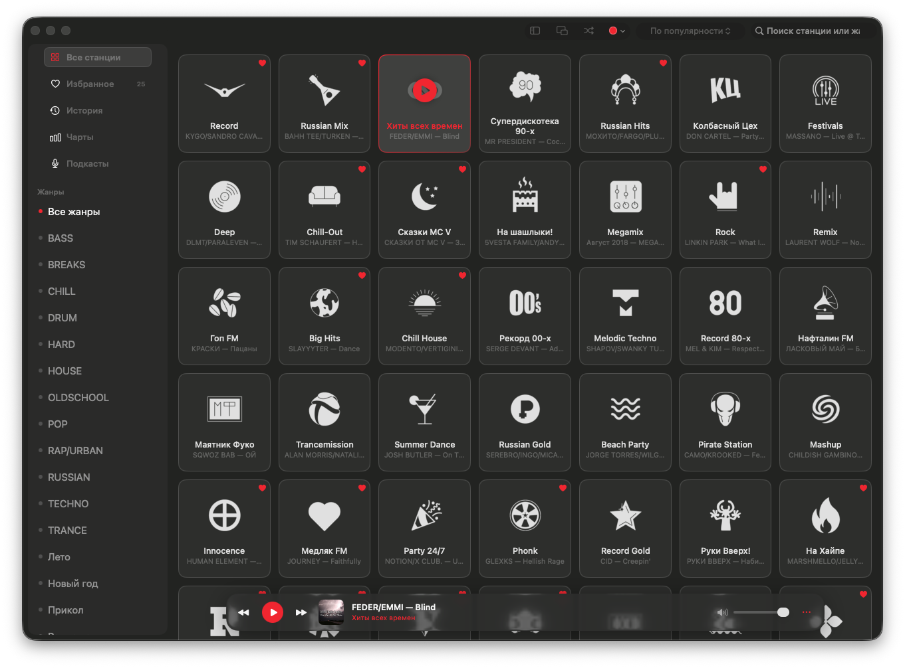

### Избранное

Сохранённые станции в той же сетке.

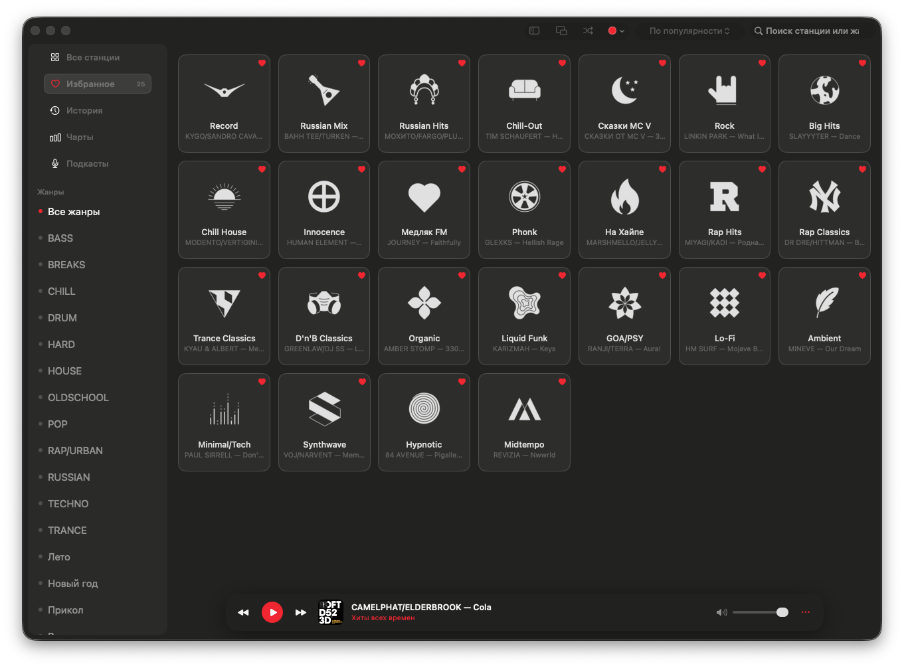

### История треков

Что играло на слушанных станциях, с обложками, временем и переходом в Apple Music.

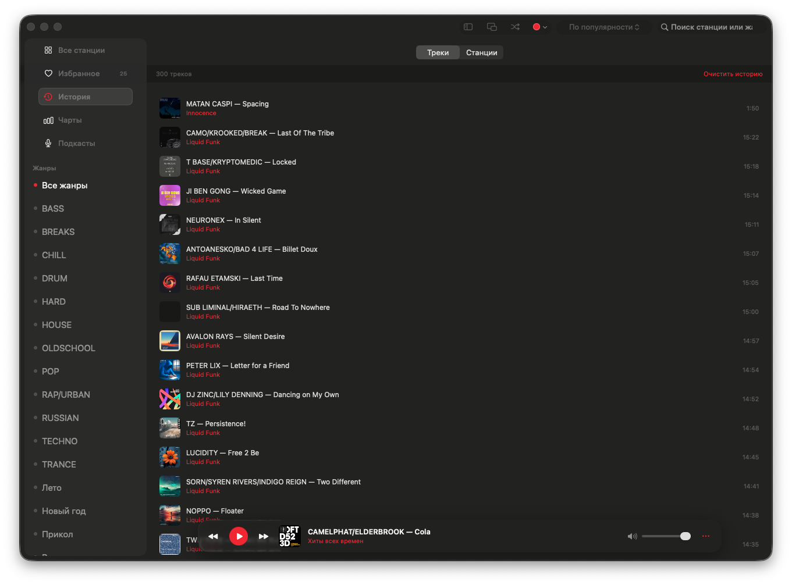

### Статистика прослушивания

Локальная статистика: время по станциям и количество включений. Данные не покидают Mac.

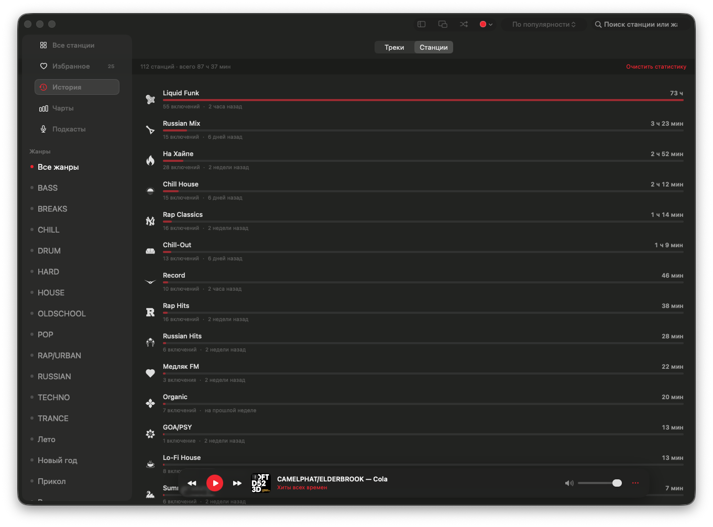

### Поиск

Фильтрация каталога по названию станции и жанру.

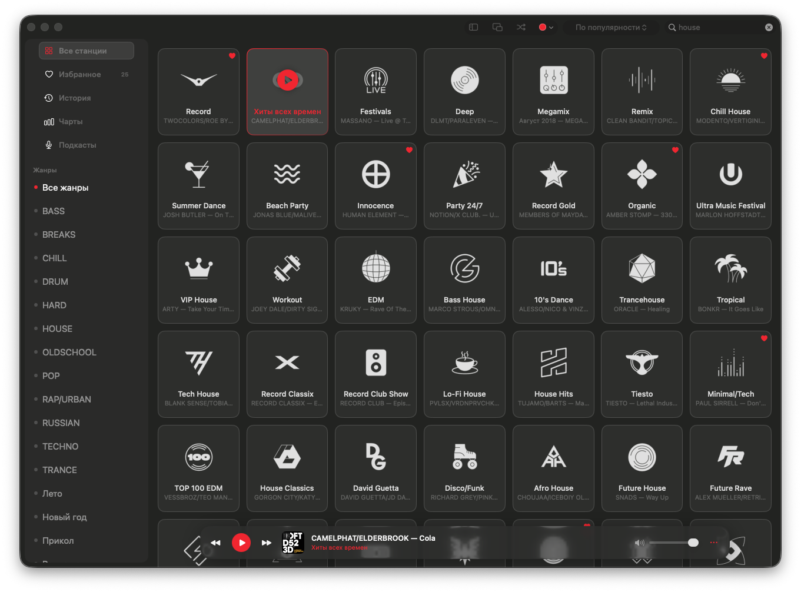

### Полный режим станции

Крупная обложка текущего трека, управление станцией и история эфира за последние сутки.

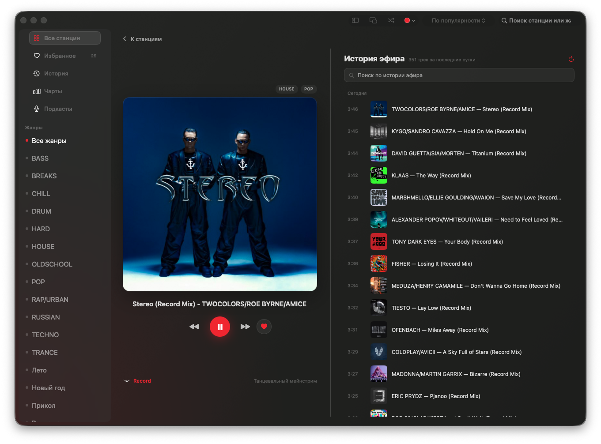

## Чарты и подкасты

### Чарты

Суперчарт, Клаб чарт и Новинки. У позиции есть обложка, тридцатисекундный фрагмент,
переход в Apple Music и копирование названия.

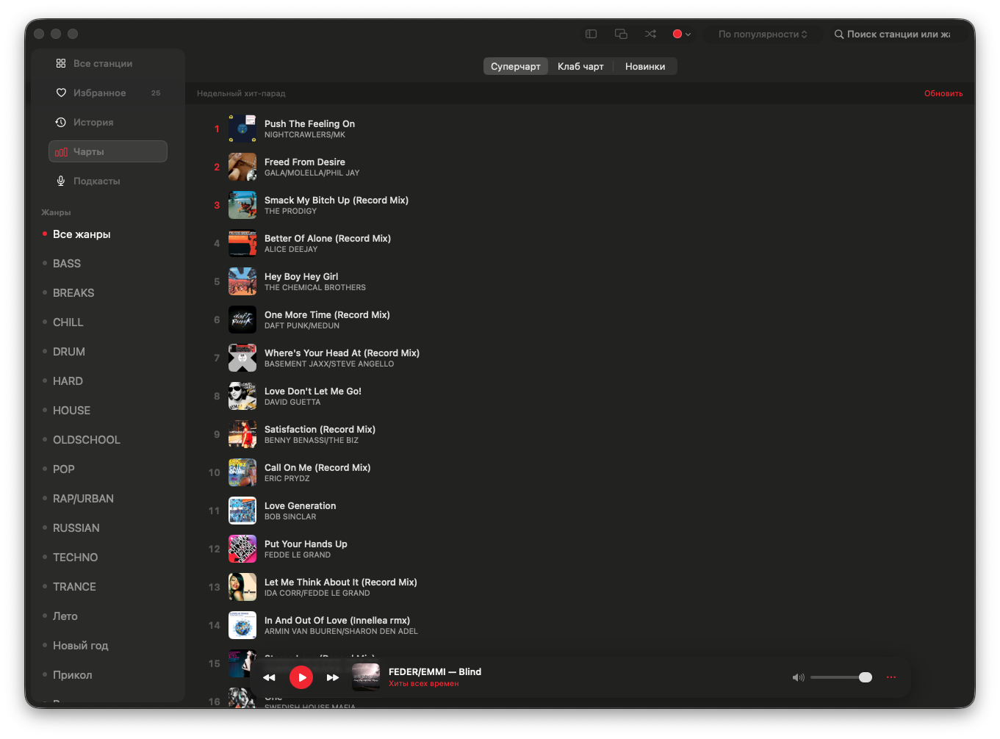

### Подкасты

Каталог из десяти шоу Radio Record с метками новых выпусков.

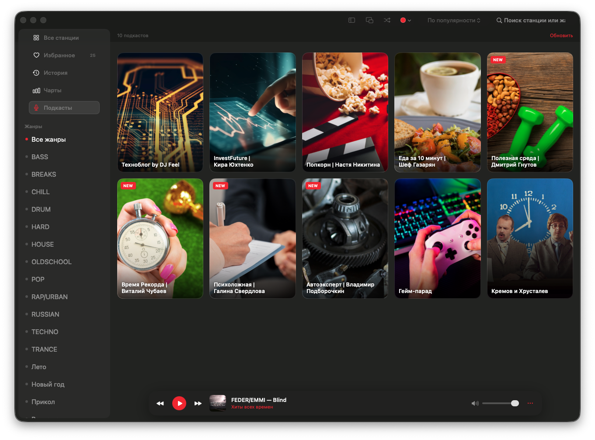

### Выпуски подкаста

Список выпусков с группировкой по дням и поиском, слева — обложка, кнопка
воспроизведения и полоса перемотки играющего выпуска.

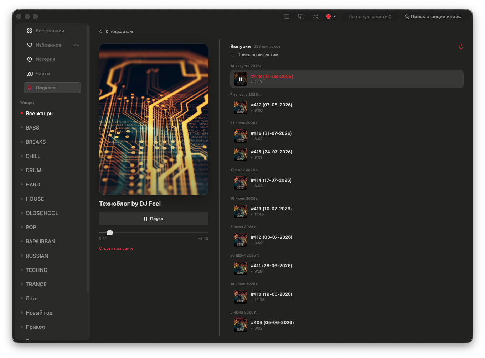

## Плеер и системные элементы

### Мини-плеер

Отдельное квадратное окно с обложкой, управлением и громкостью.

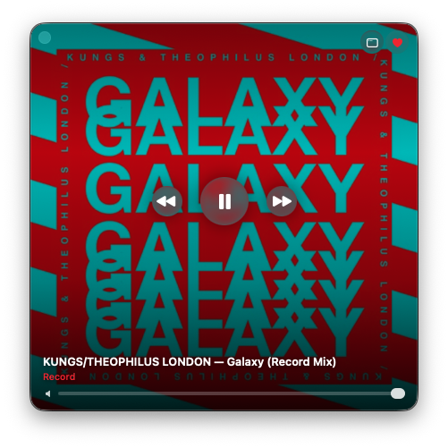

### Плеер в строке меню

Текущий трек, избранные станции и основные кнопки без открытия главного окна.

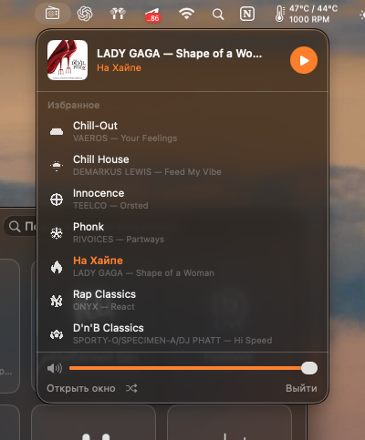

## Оформление и язык

### Акцентный цвет

Акцент выбирается в верхней панели: красный, нейтральный, оранжевый, зелёный,
голубой, розовый и фиолетовый. На снимке — голубой.

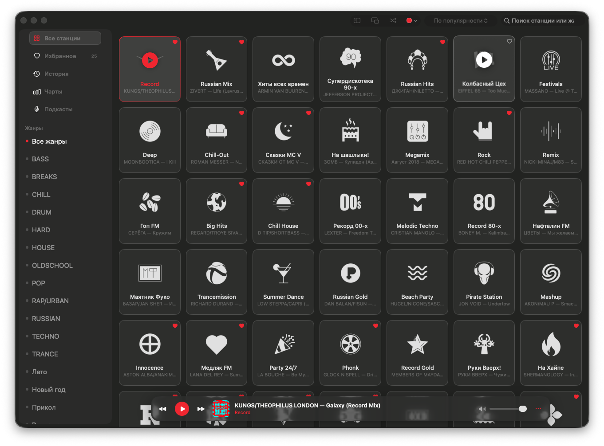

### English interface

Интерфейс на английском — язык выбирается автоматически по настройкам macOS.
Названия жанров приходят от API Radio Record и остаются на русском.

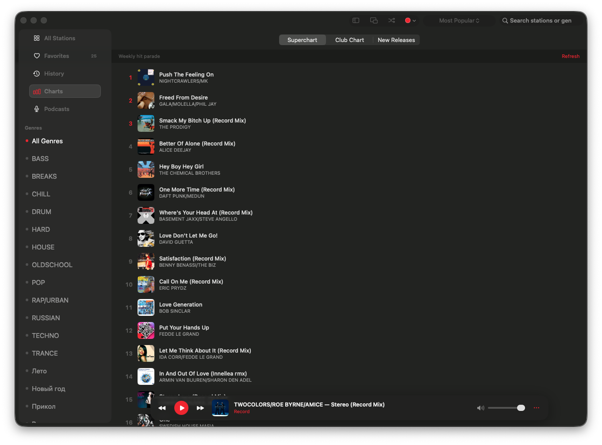

## Набор для главного README

- Обложка проекта: `01-all-stations.png`
- Новое в 2.0: `07-charts.png`, `08-podcasts.png`, `09-podcast-episodes.png`
- Радио: `06-full-station.png`, `02-favorites.png`, `03-history.png`, `05-search.png`
- Плеер: `10-mini-player.png`, `11-menubar-player.png`
- Оформление и язык: `12-accent-color.png`, `13-english-interface.png`
